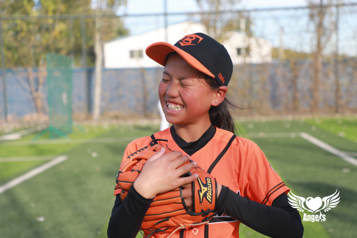
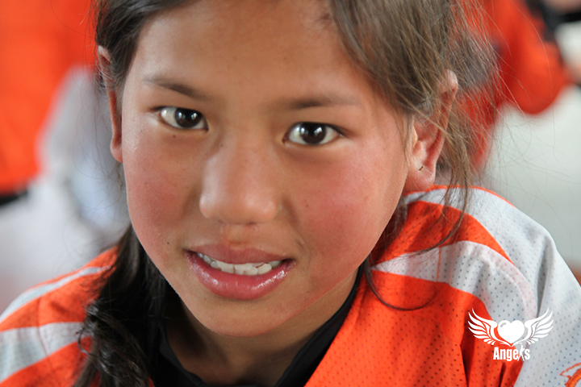

作者 : Arno

> 嗨你好，这是属于恩扎古子和棒球红场的故事。

## **关于古子** 💬
* 姓名：恩扎古子 
* 生日：2009-03-08
* 星座：双鱼座 ♓️
* 民族：彝族
* 家乡：四川省｜凉山州
* 简介：“爱笑，爱棒球，爱队友”

## **棒球和古子** ⚾
> 2020年9月，古子跟随着孙岭峰教练，走出了大凉山进入了“强棒天使棒球基地”成为了一名准棒球运动员。
> 在这里古子和其他或多或少有着相同背景的孩子们，上午一起学习文化课程，下午一起进行棒球训练，基地的红土上记录着他们的少女时代。

  据了解，强棒基地的孩子们通常早上6:30就已经起床，晚上9:30才能入睡，这样的作息时间对于十岁左右的孩子来说实属不易。
即便如此，承重的学习和训练压力并没有阻止这些可爱的孩子们对知识的渴望和对棒球的热爱，更没有抹去古子嘴角的笑容还有眼神中的光亮。
虽然入队时间不长，也还没有真正的接触过比赛，但古子认真的对待每一次的训练，努力的克服每一个难题。古子曾透露自己的梦想是成为一个棒球教练，并且希望孙教练不要再为资金发愁。
在古子小小的世界里棒球就是她的全部，古子对于棒球的那份热诚还有她的善良懂事，真的让人印象深刻。 

