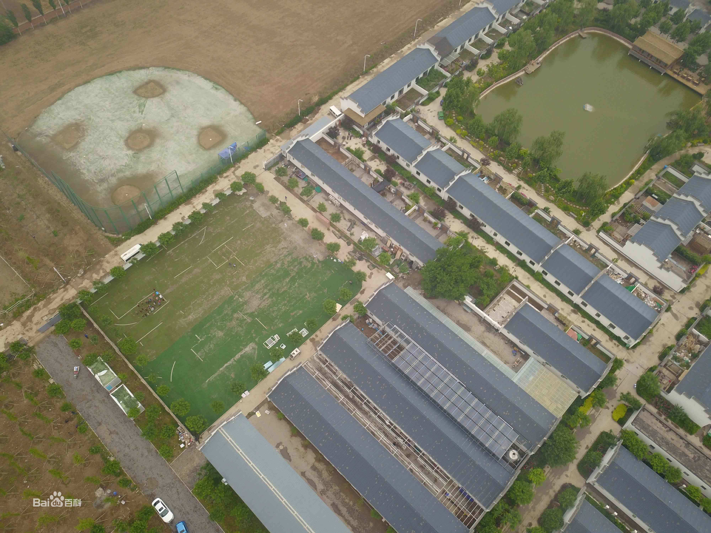

作者 : Arno

> 每个孩子都能在强棒基地中成长为小天使:)

## **关于强棒天使**  :love_letter:

| 名称 | 强棒天使项目（中华少年儿童慈善救助基金会下困境儿童救助项目 |
| ----  | ----  |
| 属性  | 非营利组织|
| 登记单位| 中华少年儿童慈善救助基金会 |
| 社团地址  | 北京通州漷县马黄路运河徽派印象5号院强棒天使棒球基地|

强棒基地由前国家棒球队队长孙岭峰与爱心人士联合筹资建设，创建中国第一支公益棒球队。基地主要资助对象为全国范围内 7-10 岁困境儿童，
通过专业的棒球技能获得职业发展方向和未来的就业机会。截止到 2020 年11月，项目共资助困境儿童80名，其中女孩 26名，
多数儿童来自四川大凉山彝族自治州。通过基地的学习训练，她们重拾了信心也对未来建立目标，部分孩子通过努力训练走向了更大的舞台，获得了更多人的关注和认可。
2019年12月，第一批女孩入驻强棒天使基地，至今已有26名女孩，最小的6岁，最大14岁。25个来自四川大凉山的彝族姑娘。她们分别组成了U10和U12年龄组，是中国第一支女子棒球队。

> :exclamation: :exclamation: :exclamation: [点击了解更多强棒项目的详细内容](https://baike.baidu.com/item/%E5%BC%BA%E6%A3%92%E5%A4%A9%E4%BD%BF%E9%A1%B9%E7%9B%AE/53242363) :exclamation: :exclamation: :exclamation:
